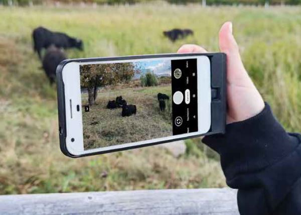

Maker Media GmbH

***

# Kamera-Handy

Das alte Handy hat eine tolle Kamera, aber der Akku ist mau und ein Tausch ist 
nicht mehr rentabel? Powerbanks sind eine Möglichkeit, das Telefon zu retten, aber unhandlich. Mit einem 3D-gedruckten Akku-Griff wird das Telefon jedoch zur supersmarten Kamera.

 

Den vollständigen Artikel gibt es in der Make 6/24 ab Seite 88.
